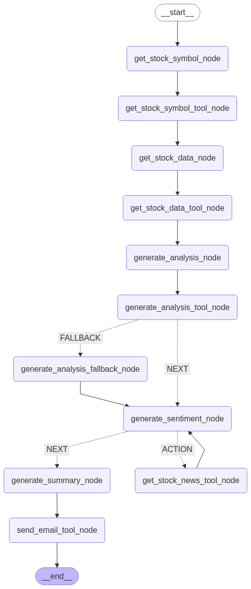

# 🤖 AI Engineer Take-Home Assignment – Report

## 🧠 Explanation & Overview

### 🧱 Chosen Framework & Architecture

For this project, I chose LangGraph, a graph-based agent orchestration framework built on LangChain. LangGraph enables fine-grained control over agent behavior, tool integration, and workflow transitions by treating each tool, agent, and logic block as a node in a stateful execution graph.

1. **🧭 Fully Autonomous Agent**: A single agent plans and performs all tasks end-to-end (data retrieval, analysis, summarization):
   - Simple, fast development and prototype.
   - Created with `AgentExecutor` and a rich system prompt.
   - All logic and tool use are controlled through the prompt.
   - Simpler to implement, but less deterministic.
   - Complex and large prompt

Agent Planning and Execution Flow:


1. **🔬 Controlled ReAct-style Agent (Preferred)**: A sequence of specialized agents and tool nodes coordinated in a LangGraph workflow with explicit state management and error recovery paths:
   - Built using **LangGraph’s node-based design**.
   - Uses **explicit nodes** for each step (data fetching, analysis, reporting).
   - Data is passed via a `State` object for short-term memory.
   - Configure `period`, `to_emails` for data consistency.
   - Offers high reliability, easier debugging, and better control.
   - Simply prompt

Agent Planning and Execution Flow:



---

## ⚙️ How the Agent Plans & Executes the Task

### 🧩 Tool-Based Modular Flow (LangGraph)

Each node in the graph represents a specific tool or logic unit. The workflow is as follows:

1. **📈 Data Acquisition Node**  
   - Fetches NASDAQ 100 tickers & prices using a data API.
   - Identifies the top gainer by % increase.
   - Saves the symbol and metadata to `State`.

2. **🧠 Code Generation + Execution Node**  
   - Prompts the LLM to write Python code to analyze 5-day performance.
   - Code is executed in a secure Python execution tool.
   - Extracts insights (e.g., average return, price trend).

3. **🧠 Sentiment Node**  
   - Retrieves recent news for the selected stock.
   - Summarizes and scores sentiment via LLM.

4. **🧠 Summarize Report Node**
   - Summarize the analysis data and sentiment.
   - Generate email friendly content.

5. **📤 Email Sending Node**  
   - Combines findings into a formatted report.
   - Sends via `smtplib`, with recipient configured in `config.py`.

### 🔄 Data Flow via State

```python
State = {
    "symbol": "NVDA",
    "stock_analysis": str,
    "stock_sentiment": str,
    ...
}
```

This ensures clean, traceable transitions and makes it easy to rerun or debug nodes independently.

---

## 🧠 How the Agent Dynamically Generates & Executes Code

- The agent uses **LLM prompting** to ask for Python code analyzing the selected stock:

```text
"Given the last {period} trading days of NVDA, write Python code to calculate average daily return and detect trend."
```

- This code is passed to a **PythonExecutionTool** and the output is returned to the graph.
- It’s then parsed and forwarded to the reporting node.

✅ This makes the agent flexible and **capable of running dynamic logic**, depending on the stock selected and the data provided.

---

## 🧩 Features Implemented

### ✅ Core Features

- **📦 Data Acquisition** – Selects top NASDAQ gainer.
- **⚙️ Dynamic Code Gen & Execution** – LLM + Python tool for analysis.
- **📧 Email Summary** – LLM + Sends formatted report to a configurable recipient.

### 🌟 Additional Features

| Feature                     | Description                                                                                                                                   |
|-----------------------------|-----------------------------------------------------------------------------------------------------------------------------------------------|
| 📰 **Sentiment Analysis**   | Fetches recent stock-related headlines and summarizes using LLM.                                                                              |
| 🔁 **Improved Robustness**  | Add Fallback node for analysis code running failed, add retry logic using `@retry` from `tenacity` and fallback node if code execution fails. |
| ⚙️ **Configuration Support** | Email recipient and days of analysis are adjustable via `config.py`; secrets via `.env`.                                                      |

---

## 🚧 Challenges & Solutions


1. Tool Argument Validation
   - Problem: Autonomous agents generate tool arguments, which may cause data security like `email sender` exposed out and errors if missing or not pre-validated.
	- Solution: Used stateful Node that can read state or config for keeping data consistency and security.


2. Prompt Management
   - Problem: Autonomous agents required strong, complex prompts to handle diverse tasks, which may fail and not consistent.
	- Solution: Used clear, dedicated prompts in controlled agents for each modular agent, prompts are more focused and stable.

3. Graph Modularity vs. Simplicity
	- Tradeoff: Full autonomy simplifies wiring but increases brittleness; LangGraph modularity increases control but requires more boilerplate.
	- Outcome: Both were implemented to show tradeoffs clearly.

---

## 🛡️ Error Handling & Reliability


- **🔁 Fallback Nodes**: 
  If analysis fails, fallback nodes generate a analysis from default code.

- **✅ Retry Logic**:  
  Tool executions use:
  ```python
  @retry(stop=stop_after_attempt(3), wait=wait_fixed(2))
  ```

- **🔒 Secrets & Config Management**:  
  - `.env` holds credentials like SMTP passwords.  
  - `config.py` holds runtime parameters like recipient and analysis length.

---


## 🚀 Future Improvements

1. **⚡ Parallel Execution**  
   - Enable the **Analysis Node** and **Sentiment Node** to run in parallel, improving latency.

2. **🛡️ Data Validation & Network Robustness**  
   - Add explicit validation on fetched stock data.
   - Implement **generic fallback paths** for network/API errors.

3. **📊 Richer Reporting**  
   - Include **graphical charts**, links to stock data, or even HTML-formatted emails with interactive elements.

4. **📊 Richer Reporting**  
   - Multiple agents.

## 🧾 Summary

This project showcases a **multi-step, agentic workflow** using LangGraph and demonstrates:

- 📌 Modular tool orchestration via ReAct-like node graphs.
- ⚙️ Dynamic LLM-generated Python analysis.
- 📬 Reliable, configurable report delivery.

It’s **extensible**, supports **graceful failure recovery**, and balances autonomy with developer control — ideal for future enhancements like dashboards, charts, or multi-stock comparisons.
